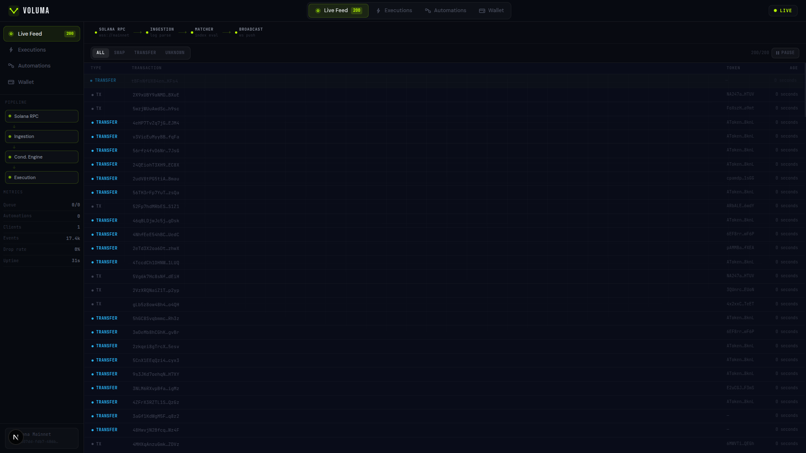
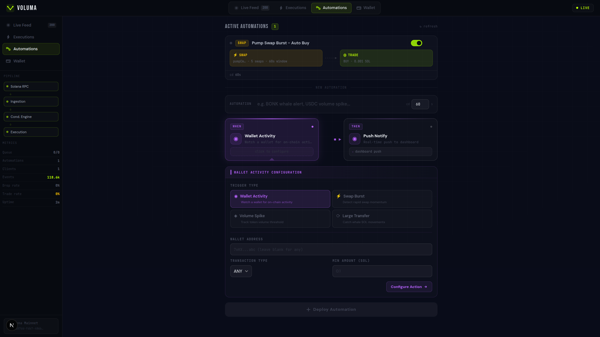
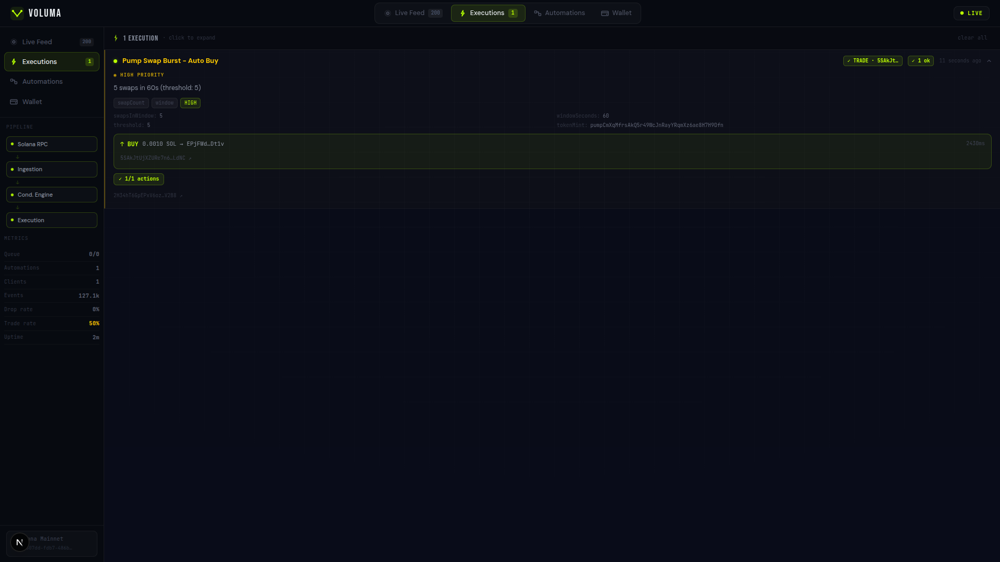
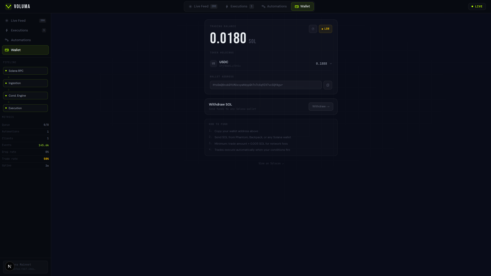

# Voluma — On-Chain Automation Engine

> Execute on-chain actions directly from live Solana activity — in seconds, not minutes.

On-chain signals emerge and disappear in seconds. By the time manual traders react, the opportunity is already gone.

Voluma continuously ingests live Solana transactions and evaluates them in real time.

[](https://solana.com)
[](https://jup.ag)
[](LICENSE)
[](https://colosseum.org)

---

## What is Voluma?

Voluma is a **real-time on-chain automation engine for Solana**. It monitors the Solana blockchain as transactions happen, evaluates user-defined conditions against every transaction, and executes actions — including real BUY/SELL trades via Jupiter DEX — automatically, without human intervention.

Voluma functions as an execution layer on top of Solana — connecting real-time on-chain signals directly to automated actions.

It bridges the gap between on-chain data and execution — turning raw blockchain activity into actionable outcomes without manual intervention.


---


## ⚡ Why this matters

On-chain opportunities are short-lived.

- Swap bursts last seconds  
- Wallet activity happens instantly  
- Volume spikes rise and disappear quickly  

Most tools today:
- notify too late  
- require manual execution  
- or need complex infrastructure  

Even experienced traders cannot easily say:

> *"When this wallet buys, execute a trade for me automatically."*

Voluma enables this by directly connecting live on-chain signals to automated execution.

Recent improvements in Solana's throughput and low-latency RPC streaming make it possible to react to on-chain activity in real time. Voluma is built to leverage that capability fully.

---

## 🧠 How it works

**1. Define a condition**  
Choose a trigger like wallet activity, swap burst, volume spike, or large transfer.

**2. Voluma listens to the chain**  
Transactions stream in real time and are evaluated instantly.

**3. Action executes automatically**  
When a condition matches, Voluma triggers — notify, webhook, or execute a trade.

This creates a continuous loop:

Solana Event → Condition Evaluation → Action Execution → Real-time Feedback

Voluma closes the loop between on-chain activity and execution.

---

## 🔥 What makes Voluma different

- **Closed-loop execution (signal → decision → action)**  
  Voluma does not stop at detection. It evaluates conditions, executes trades, and confirms outcomes — completing the full automation loop in real time.

- **Real-time processing**  
  No polling. No delays. Direct reaction to live transaction flow.

- **No setup friction**  
  Open the dashboard, create a condition, and it starts immediately.

- **Encrypted wallet storage**  
  Each user has a dedicated trading wallet. Private keys are AES-256 encrypted at rest and decrypted only during trade execution.

- **Built specifically for Solana**  
  Native understanding of transaction logs and DEX activity.

---
## The Problem

Solana processes hundreds of thousands of transactions per day. Profitable signals — a whale moving tokens, a swap burst beginning, volume spiking on a token — last seconds, not minutes. By the time a trader manually spots a signal and executes, the opportunity is gone.

Existing solutions either:
- Require technical infrastructure to run bots (developers only)
- Operate off-chain and poll data (introduces lag)
- Don't support automated execution (alerts only, no action)
- Don't exist on Solana at the right abstraction level

**Voluma makes on-chain automation accessible to any trader in under 60 seconds.**

---

## Demo

> 📹 **[Watch the Demo Video →](https://youtu.be/4jbm5CBOQ0A)*

> 🎤 **[Watch the Pitch Video →](https://youtu.be/Pj3oKvSct10)**

### What the demo shows:
1. Real Solana mainnet transactions streaming live into the dashboard
2. Creating a visual automation pipeline (WHEN trigger → THEN action) in under 30 seconds
3. A condition firing in real time when the chain meets the threshold
4. An automated trade executing on Jupiter DEX with a verifiable transaction hash on Solscan

---

## Screenshots

| Live Feed | Automations |
|-----------|-------------|
|  |  |

| Executions | Wallet |
|------------|--------|
|  |  |

---

## How It Works

```
Solana Mainnet (WebSocket)
        │
        ▼
  Ingestion Layer
  (log parsing, event normalization)
        │
        ▼
  Condition Engine
  (inverted index, sliding windows)
        │
        ▼
  Execution Engine
  (guard checks → Jupiter quote → on-chain tx)
        │
        ▼
  WebSocket Broadcast
  (real-time push to dashboard)
```

This entire pipeline is live and running on Solana mainnet — from ingestion to execution.

**Every transaction on Solana is evaluated in under 50ms.** No polling. No RPC spam. A single persistent WebSocket connection handles the entire ingestion pipeline.

---

## Core Features

### 4 Condition Types

| Condition | What it Detects |
|-----------|----------------|
| **Wallet Activity** | Any transaction from a specific wallet address — buy, sell, or transfer |
| **Swap Burst** | N or more swaps of a token within a sliding time window |
| **Volume Spike** | Total SOL volume through a token exceeding a threshold in a time window |
| **Large Transfer** | Any SOL transfer above a defined amount, across all of mainnet |

### 4 Action Types

| Action | What it Does |
|--------|-------------|
| **Push Notify** | Real-time notification to dashboard via WebSocket |
| **Webhook** | HTTP POST to any endpoint — integrates with Discord, Slack, custom systems |
| **Server Log** | Structured JSON log entry for backend monitoring |
| **Auto Trade** | Real BUY or SELL via Jupiter DEX aggregator, executed automatically |

### Visual Pipeline Builder
Conditions are built using a node-based visual UI — a [WHEN] trigger node connected to a [THEN] action node. No forms, no dropdowns, no confusion. The mental model is immediate.

### Server-Side Encrypted Wallet System
Voluma generates a dedicated trading keypair per user. Private keys are AES-256-CBC encrypted and stored in the database. The server decrypts keys only when executing trades or withdrawals, then signs transactions on behalf of the user. The encryption key is held separately in environment variables, protecting against database-only breaches.

This design enables fully automated execution without requiring user interaction at trigger time.

### Trade Safety (TradeGuard)
Every automated trade passes through a multi-layer guard system before execution:
- Per-user rate limiting (5 trades/minute max)
- Live balance check against RPC
- Token mint validation (base58 format check)
- Execution count limits (once, N times, or unlimited)
- Deduplication cache (same event cannot trigger two identical trades)

---

## Architecture

```
voluma/
├── server/                 # Fastify backend, Node.js + TypeScript + Bun
│   └── src/
│       ├── index.ts                    # Server bootstrap, all routes
│       ├── ingestion/
│       │   ├── provider.ts             # NormalizedEvent interface
│       │   ├── public-rpc-provider.ts  # Mainnet WebSocket ingestion
│       │   └── yellowstone-provider.ts # Helius gRPC stub (future)
│       ├── conditions/
│       │   ├── engine.ts               # Condition evaluator, inverted indexes
│       │   └── types.ts                # Condition/Action type definitions
│       ├── execution/
│       │   ├── executor.ts             # Action dispatcher, retry logic
│       │   ├── tradeExecutor.ts        # Jupiter DEX integration
│       │   └── tradeGuard.ts           # Safety layer, rate limiting
│       ├── wallets/
│       │   └── walletManager.ts        # AES-256 keypair management
│       ├── ws/
│       │   └── broadcast.ts            # WebSocket room management
│       ├── queue/
│       │   └── in-memory-queue.ts      # Concurrent event processor
│       └── db/
│           ├── db.ts                   # SQLite + WAL mode, schema init
│           ├── conditionRepo.ts        # Condition CRUD + execution count
│           ├── statsRepo.ts            # Trigger statistics
│           ├── walletRepo.ts           # Wallet record persistence
│           ├── processedEventRepo.ts   # Deduplication cache (conditionId:signature)
│           └── pendingTxRepo.ts        # Pending transaction tracking
├── web/                    # Next.js 14 frontend, TypeScript
│   └── app/
│       ├── page.tsx                    # Landing page
│       ├── dashboard/page.tsx          # Main dashboard
│       ├── components/
│       │   ├── ConditionBuilder.tsx    # Visual pipeline builder
│       │   ├── ConditionList.tsx       # Active automations with live state
│       │   ├── ConditionsPanel.tsx     # Container panel
│       │   ├── EventFeed.tsx           # Live transaction stream
│       │   ├── TriggerFeed.tsx         # Execution history
│       │   ├── WalletPanel.tsx         # Wallet management + balance
│       │   └── SystemStats.tsx         # Pipeline health metrics
│       └── hooks/
│           ├── useSocket.ts            # WebSocket client, reconnect logic
│           ├── useConditions.ts        # Conditions CRUD
│           ├── useWallet.ts            # Wallet state + trade callbacks
│           └── useUserId.ts            # Browser-local identity
│
└── README.md               # This file
```

---

## Tech Stack

### Backend
| Component | Technology | Why |
|-----------|-----------|-----|
| Runtime | Bun + Node.js | Fast startup, native TypeScript |
| Framework | Fastify | Low overhead, schema validation |
| Database | SQLite + better-sqlite3 | Zero infra, WAL mode, fast synchronous reads |
| WebSocket | ws library | Direct control over connection lifecycle |
| Blockchain | @solana/web3.js | Official Solana SDK |
| Trade Execution | Jupiter Aggregator v6 | Best liquidity routing on Solana |
| Validation | Zod | Runtime schema validation |

### Frontend
| Component | Technology | Why |
|-----------|-----------|-----|
| Framework | Next.js 14 (App Router) | Fast, server-side capable |
| Language | TypeScript | Type safety across the stack |
| Styling | Inline styles + Tailwind CSS | Full control, no class conflicts |
| Fonts | Bebas Neue + JetBrains Mono + DM Sans | Engineering aesthetic |
| UI Primitives | shadcn/ui (Select only) | Minimal dependency |

---

## Infrastructure Philosophy

> **Voluma was built intentionally at zero infrastructure cost.**

This is not a limitation — it is a design constraint.

Voluma is intentionally built to operate without paid infrastructure by leveraging:

- Solana public WebSocket RPC for ingestion
- In-memory indexing for real-time evaluation
- SQLite for local persistence

This demonstrates that the full execution pipeline works end-to-end without external dependencies.

**With investment, the upgrade path is clear and non-breaking:**
- Public RPC → Helius Yellowstone gRPC (already stubbed in `yellowstone-provider.ts`)
- SQLite → PostgreSQL (conditionRepo/walletRepo interfaces abstract the DB layer)
- Single server → multi-node (condition engine is stateless per evaluation)
- In-memory queue → Redis Streams (EventQueue interface is drop-in replaceable)

The architecture was designed for this migration from day one.

---

## Competitive Landscape

| Product | Chain | Real-time | Auto Trade | Encrypted Wallets | Open |
|---------|-------|-----------|------------|---------------|------|
| **Voluma** | **Solana** | **✓** | **✓** | **✓** | **✓** |
| Gelato Network | EVM only | ✓ | ✓ | ✗ | ✗ |
| Chainlink Automation | EVM only | ✓ | Partial | ✗ | ✗ |
| Dialect | Solana | ✓ | ✗ | ✓ | Partial |
| Generic alert bots | Various | Partial | ✗ | ✓ | Varies |

**Voluma is the only real-time, condition-based automation engine with encrypted wallet storage and native trade execution on Solana.**

---

## Roadmap

### Currently Shipped (Hackathon Build)
- [x] Real-time Solana mainnet ingestion via WebSocket
- [x] 4 condition types with configurable parameters
- [x] Automated trade execution via Jupiter DEX
- [x] Server-side AES-256 encrypted wallet per user
- [x] Webhook delivery with retry logic and idempotency
- [x] Visual node-based automation builder
- [x] Live dashboard with WebSocket real-time updates
- [x] Trade safety guard (rate limit, balance check, dedup)
- [x] SQLite persistence for conditions, wallets, stats

### Near-term (Post-Investment Infrastructure)
- [ ] Helius Yellowstone gRPC integration (already stubbed — sub-100ms decoded tx data)
- [ ] User authentication (magic link / wallet sign-in)
- [ ] Multi-condition chains (IF this AND that → action)
- [ ] Telegram / Discord bot actions
- [ ] Historical trigger analytics
- [ ] Condition marketplace (share and fork automation strategies)

### Vision
- [ ] Cross-chain expansion (EVM via similar log-subscription architecture)
- [ ] Strategy backtesting against historical on-chain data
- [ ] Team workspaces for trading groups
- [ ] API access for developers building on top of Voluma

---

## Quick Start

```bash
# Clone
git clone <repo>
cd voluma

# Start backend
cd server
cp .env.example .env          # Add WALLET_ENCRYPTION_KEY (≥32 chars)
bun install
bun run dev

# Start frontend (new terminal)
cd ../web
cp .env.example .env.local    # Add NEXT_PUBLIC_API_URL=http://localhost:3001
bun install
bun run dev

# Open http://localhost:3000
```

See [`server/README.md`](./server/README.md) and [`web/README.md`](./web/README.md) for full setup instructions.

---

## Colosseum Frontier 2026

Built for the Colosseum Frontier Hackathon (April–May 2026). Voluma represents a complete, working product — not a prototype or proof of concept. Every feature described above is implemented and running against Solana mainnet.

The goal beyond the hackathon is the Colosseum Accelerator program. Voluma solves a real problem with real infrastructure, and the zero-cost build proves the model works before a dollar of infrastructure spend.

Voluma demonstrates that real-time, automated execution on on-chain signals is not theoretical — it is already operational.

---

## License

MIT — see [LICENSE](LICENSE)

---

*Built on Solana. Powered by Jupiter. Designed for traders.*