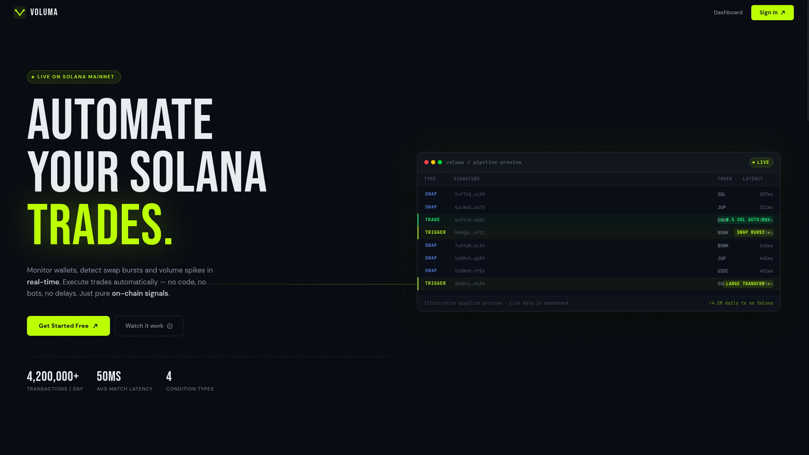

<div align="center">



<br/>

### Real-time on-chain automation for Solana

Define a condition. Voluma watches the chain. Your action fires the moment it matches — a notification, a webhook, or a live trade through Jupiter.

<br/>

[](https://solana.com)
[](https://jup.ag)
[](https://voluma.online)
[](./LICENSE)

**[voluma.online](https://voluma.online)** · [Terms](https://voluma.online/terms) · [Privacy](https://voluma.online/privacy)
</div>

<br/>

## The problem

Solana moves fast. A wallet starts accumulating, a token sees a sudden burst of swaps, a transfer crosses a size that matters — and the window to act on it is seconds, not minutes. By the time a human notices and reacts manually, the signal is already priced in.

Voluma closes that gap. It holds a live connection to Solana mainnet, evaluates every relevant transaction against the automations you've defined, and executes the result automatically — including signing and submitting a real trade — without you watching a screen.

It's built as a general **condition → action** engine, not a single-purpose bot. Trading is the action that proves the loop end-to-end with a verifiable on-chain result; the same pipeline works just as well for alerting or webhook-driven workflows feeding other systems.

<br/>

<div align="center">
<table>
<tr>
<td width="50%"><p align="center"><sub>Live Feed — every relevant mainnet transaction, in real time</sub></p></td>
<td width="50%"><p align="center"><sub>Visual builder — WHEN this happens → THEN do that</sub></p></td>
</tr>
<tr>
<td width="50%"><p align="center"><sub>Executions — full explanation of why a condition fired</sub></p></td>
<td width="50%"><p align="center"><sub>Wallet — encrypted custody and live balance</sub></p></td>
</tr>
</table>
</div>

<br/>

## How it works

**1. Define a condition.** Wallet activity, a swap burst, a volume spike, or a large transfer — set the thresholds and an optional token filter through a visual builder. No code.

**2. Voluma watches the chain.** A persistent WebSocket subscription streams Solana mainnet activity. Every transaction is evaluated against your active conditions through an indexed matcher, not a linear scan.

**3. The action fires automatically.** A match dispatches its configured action: a dashboard push, a webhook with retries and idempotency headers, a server log, or a real BUY/SELL on Jupiter DEX — signed from your dedicated, encrypted trading wallet.

```
Solana Mainnet (WebSocket)
         │
         ▼
  Ingestion Layer        →  parse, dedupe, selectively enrich, RPC failover
         │
         ▼
  Condition Engine       →  indexed match, sliding windows, cooldowns
         │
         ▼
  Execution Engine       →  retry policy, per-wallet locking, idempotency
         │
    ┌────┴─────┐
    ▼          ▼
Trade Executor   Realtime Broadcast
(Jupiter DEX)    (per-user WebSocket rooms)
```

<br/>

## What's actually in it

**Four ways to watch the chain.** Wallet activity, swap bursts, volume spikes, and large transfers — each with its own matching logic, not a single generic "alert" type stretched four ways.

**Four ways to react.** Push notification, HTTP webhook (with retries, idempotency keys, and a delivery ID), a structured server log, or a real trade.

**Trades that are guarded, not just fired.** Every trade — automated or manual — passes through live balance checks, a price-impact cap, a quote-freshness check, per-user rate limiting, and per-wallet execution locking before a transaction is ever built. Three independent layers of idempotency mean the same on-chain event can never trigger the same trade twice.

**Wallets that are actually encrypted.** Each user gets a dedicated, server-held Solana keypair. Private keys are encrypted with AES-256-GCM using a per-wallet key derived via `scrypt` — not a shared static key. Exporting a key or withdrawing funds requires a short-lived, single-use verification step plus a typed confirmation, every time.

**One ledger for every trade.** Whether a trade fired from a condition or was sent manually from the wallet panel, it lands in the same history view — confirmed, pending, or failed, with slippage, price impact, execution time, and a Solscan link, tagged by whether it was automated or manual.

**Infrastructure that fails over instead of falling over.** RPC providers are health-tracked continuously; after a run of failures, ingestion automatically switches providers and reports its current state (`HEALTHY` / `DEGRADED` / `FALLBACK`) live to the dashboard.

<br/>

## Built with

<div align="center">


</div>

Auth runs on **Better Auth** with Google OAuth. RPC is **Helius** by default with a configurable secondary and a public-RPC fallback always in the chain. The web app deploys to **Vercel**; the server runs as a Docker container on **Railway**.

<br/>

## Repository

<details>
<summary><strong>Show full structure</strong></summary>

```
voluma/
├── README.md
├── CONTRIBUTING.md
├── LICENSE
├── assets/                  # Screenshots used in this README
│
├── server/                  # Fastify backend
│   ├── src/
│   │   ├── index.ts             # Bootstrap, routes, in-memory state
│   │   ├── auth.ts              # Session validation
│   │   ├── conditions/          # The matching engine
│   │   ├── execution/           # Action dispatch + trade execution
│   │   ├── wallets/             # Encrypted custody
│   │   ├── security/            # Step-up verification
│   │   ├── rpc/                 # Provider health + failover
│   │   ├── ingestion/           # Live Solana ingestion
│   │   ├── tokens/               # Mint → symbol resolution
│   │   ├── ws/                  # Realtime broadcast
│   │   ├── queue/                # Backpressure-aware event queue
│   │   ├── lib/                  # TTL cache
│   │   └── db/                   # Repository layer (Postgres)
│   ├── migrations/
│   └── README.md
│
└── web/                      # Next.js 15 frontend
    ├── app/                     # Pages — landing, dashboard, login, legal
    ├── components/              # Dashboard + landing UI
    ├── hooks/                   # Socket, conditions, wallet state
    ├── lib/                     # Better Auth client/server config
    └── README.md
```

</details>

See [`server/README.md`](./server/README.md) for the backend architecture and [`web/README.md`](./web/README.md) for the frontend.

<br/>

## Quick start

```bash
git clone <repo-url> && cd voluma

cd web && cp .env.example .env.local && bun install
npx @better-auth/cli@latest migrate

cd ../server && cp .env.example .env && bun install
psql "$DATABASE_URL" -f migrations/001_voluma_tables.sql
psql "$DATABASE_URL" -f migrations/002_reliability_and_security.sql
bun src/index.ts

cd web && bun run dev
```

Full environment variables and setup steps live in each service's README. If you're deploying rather than running locally, read the [production database connection note](./server/README.md#database) first — the connection string that works locally is not the one that works on Vercel/Railway.

<br/>

## Security

Voluma is custodial software — it holds real keys and signs real transactions on mainnet. The security model (encrypted storage, step-up verification, SSRF protection, RPC failover) and an honest list of what's hardened versus still on the roadmap are documented in [`server/README.md`](./server/README.md#security). Found a vulnerability? Please don't open a public issue — see [`CONTRIBUTING.md`](./CONTRIBUTING.md#reporting-a-security-issue).

<br/>

## Roadmap

- Helius Yellowstone gRPC ingestion (decoded transaction data, no log-heuristic parsing)
- Broader rate-limit coverage across read/list endpoints
- Auth and/or rate limiting on currently public system endpoints
- WebSocket origin validation as a second layer on top of session auth
- Multi-condition chains (`IF this AND that → action`)
- Telegram / Discord action targets
- Historical trigger analytics

<br/>

## License

MIT — see [LICENSE](./LICENSE).

<div align="center">
<sub>Built on Solana. Execution routed through Jupiter.</sub>
</div>